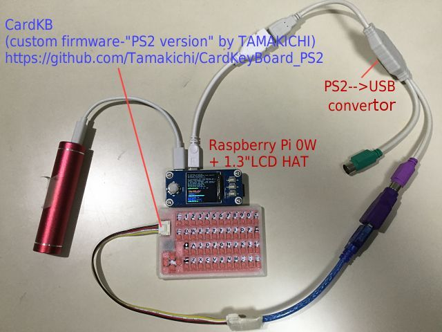
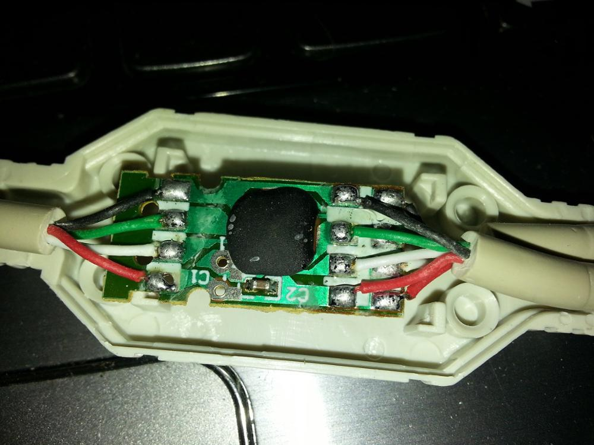
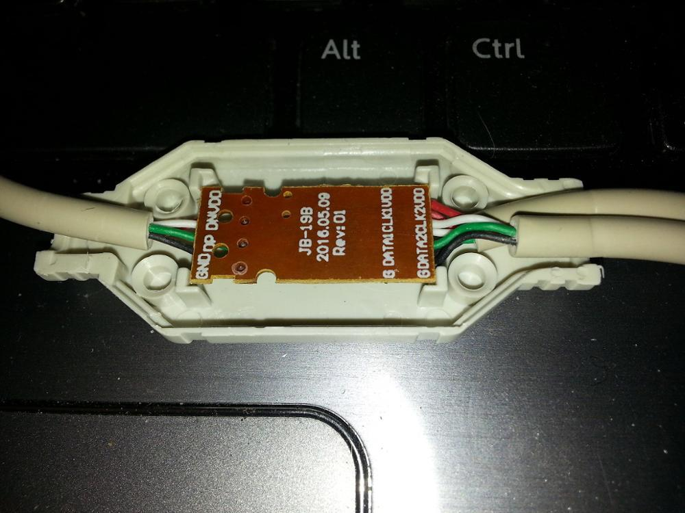

# CardKeyBoard PS/2 interface version

  

## Introduction
This software is a firmware that makes CardKeyBoard for M5stak compatible with PS / 2 interface.
It is intended for use on microcomputer boards that use a PS / 2 keyboard. The operation with
IchigoJam V1.3 and Toyoshiki Tiny BASIC for Arduino STM32 V0.87 has been confirmed.

The implementation uses Arduino environment.
This firmware is developed by modifying the source of the original version of CardKeyBoard firmware.

Source of original version of CardKeyBoard

Github m5stack / M5-ProductExampleCodes
https://github.com/m5stack/M5-ProductExampleCodes/tree/master/Unit/CARDKB

You can undo by writing the above original version.

Please use this software freely. 

## Note
No liability can be assumed for CardKB becoming unusable using the book or software.
In addition, the manufacturer's warranty may not be received.
Please use it after remodeling and understanding of self-responsibility.

## Interface specifications
The original I2C interface has been changed to the PS / 2 interface.

  

|Terminal / conductor|  signal  |
|:--:|:--:|
|Black   |GND  |
|Red   |5V or 3.3V  |
|Yellow   |CLK/D+(A4)  |
|White   |DATA/D-(A5) |

When using a USB connector (male), connect the above wires to the following terminals. 
  

## Keyboard specifications
In the original version, the LED (NeoPixcel) flashes at startup, but does not flash in this firmware.

Please specify a Japanese keyboard for the keyboard used by the host computer.

The specifications and functions of the keyboard are almost the same as the original, but the
following key assignments are newly added.  

|Key function|  Operation  |
|:--|:--|
|[F1]|[1]＋[Fn]
|[F2]|[2]＋[Fn]
|[F3]|[3]＋[Fn]
|[F4]|[4]＋[Fn]
|[F5]|[5]＋[Fn]
|[F6]|[6]＋[Fn]
|[F7]|[7]＋[Fn]
|[F8]|[8]＋[Fn]
|[F9]|[9]＋[Fn]
|[F10]|[0]＋[Fn]
|[Insert]|[BS]＋[Fn]
|[Home]	|[←]＋[Fn]
|[PageUp]|[↑]＋[Fn]
|[カナ]	|[k]＋[Fn]
|[PageDown]	|[↓]＋[Fn]
|[End]|[→]＋[Fn]

[F1] to [F10] are function keys.   

## Prepare libraries required for compiling sketches
Adafruit NeoPixel Library Search and install "Adafruit NeoPixel" in the library manager of Arduino IDE.  
  

- ps2dev (Emulating a PS2 device)
 [PS2 mouse interface for Arduino](http://playground.arduino.cc/ComponentLib/Ps2mouse)
 
- Click and download **Attach: ps2dev.zip** at the bottom from PS2 mouse interface for Arduino .
- Unzip and place it under libraries in your Arduino environment .
- **Open ps2dev.cpp** in an editor, modify it #include "WProgram.h"to #include "Arduino.h", and save it.
- **Open ps2dev.h** in an editor, #include "WConstants.h"comment out ( //#include "WConstants.h") and save.

## Write firmware
Compile the attached sketch with Arduino IDE or write the compiled image file CardKeyBoard.ino.hex in the
bin folder using a tool such as avrdude . Programmers should use what they are accustomed to.

(Caution) Do not change the fuse bit.
If you are using ProgIsp , please disable the default Program Fuse setting.

Writing with Arduino IDE
Open CardKeyBoard.ino attached to this project in Arduino IDE.
In the Arduino IDE environment, specify Arduino Pro (3.3V 8MHz) as the board selection and write.

(Write operation of boot loader ([Tool]-[Write boot loader]) is prohibited.)

Since the board does not have a bootloader, writing by a programmer (ArduinoISP, USBasp, USBtinyISP, etc.) from the ICSP terminal is required.
Programmers should use what they are accustomed to.

Specifications of ICSP terminal on board

  

By inserting a jumper into the above terminal, writing can be done simply by connecting.
(Please use a device such as fixing with tape)

 
  

Example using USBtinyISP as a programmer

  

Writing of the IDE menu [Sketch] - [writing using the writing device] in,
compile the sketch, writes.

Example of mounting a simple cable to connect via USB connector
This is an example of mounting a simple cable using a USB terminal (male) and jumper wires (male-male). 

Usage example of Toyoshiki Tiny BASIC for Arduino STM32 V0.87 

Akizuki electrons " cable mounting USB connector (A type male) ," the use was Example
(reinforcing the root with heat shrinkable tube + Ties)

  

 

# URL
http://nuneno.cocolog-nifty.com/blog/2019/03/m5stackcardkb-2.html
http://nuneno.cocolog-nifty.com/blog/2019/03/m5stackcardkb-1.html

https://www.geewiz.co.za/cables-adapters-accessories/33145-unbranded-ps2tousb-ps2-male-to-usb-female.html?sfdr_ptcid=2961_617_121776039&sfdr_hash=1b35995fb520923392eb57b89e499c4e&gclid=EAIaIQobChMIh8XCyrXL5gIV2OJ3Ch3LSQQmEAQYASABEgI6l_D_BwE

https://www.geewiz.co.za/usb-cables/33359-add-on-usb2ps2-keyboard-mouse-adapter-cable-.html

https://www.takealot.com/lindy-usb-female-to-ps2-male-adapter/PLID32845594

https://www.cables.co.za/usb-to-ps2-adaptor.html

# Local
Our Location
Crown Hyper World
Crown Hyper World
11 Mineral Crescent, Crown Mines, Johannesburg, 2025
Telephone
+27 (0)11 830 1452

Fax
+27 (0)11 830 1484
Opening Times
Mon - Thur 08:30 to 13:00
14:00 to 16:00
Friday 08:30 to 12:00
13:30 to 16:00
Saturday 08:30 to 13:00
Sunday Closed

USBTPS2 @ R 10.01
http://www.crownhyperworld.co.za/index.php?route=product/product&product_id=230&search=PS2&category_id=0&page=2

PS2 EXT @ R 15.00
http://www.crownhyperworld.co.za/index.php?route=product/product&product_id=1234&search=PS2&category_id=0

usbtps2c @ R25
http://www.crownhyperworld.co.za/index.php?route=product/product&product_id=1412&search=PS2&category_id=0&page=2

 

 

